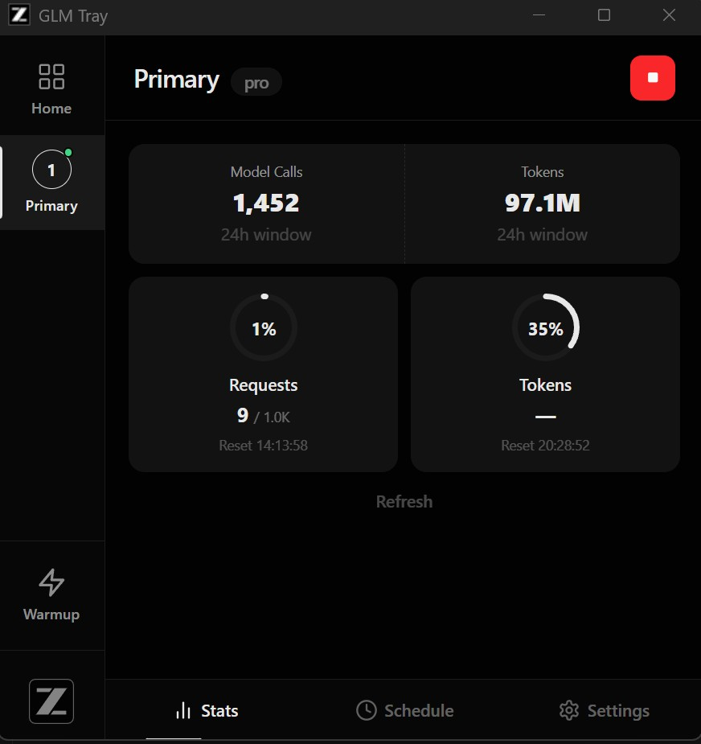

[](https://github.com/kiwina/glm-tray)

# GLM Tray 🔑

[](https://github.com/kiwina/glm-tray/releases/latest)
[](https://github.com/kiwina/glm-tray/releases/latest)
[](https://tauri.app)
[](./LICENSE)

> Keep your Z.ai / BigModel API keys alive and monitored — silently, from your system tray.

GLM Tray is a lightweight, native desktop app that sits in your system tray and watches your API keys so you never hit an unexpected quota wall or stale key. Manage up to 4 keys, visualise live quota usage, and automate keep-alive pings — all without leaving your workflow.

---

## Why You'll Love It

- 🔑 **Multi-key dashboard** — Monitor up to 4 Z.ai / BigModel API keys side by side
- 📊 **Live quota tracking** — Token limits, request counts, and model-level breakdowns at a glance
- 💓 **Keep-alive scheduler** — Three flexible modes keep keys warm automatically: Interval, Specific Times, or After Reset
- ✅ **Smart wake confirmation** — Validates success via quota delta, retries silently on failure
- 🌐 **Dual platform support** — Works with both `api.z.ai` and `open.bigmodel.cn` endpoints
- 🔔 **Auto-update notifications** — Stay current with in-app update prompts
- 🗓 **JSONL audit logging** — Optional, filterable logs with `flow_id` and `phase` fields
- ⚙️ **Global app settings** — Configure shared quota URL, LLM URL, log path, and retention from one place

---

## Screenshots



---

## Installation

Grab the latest release for your platform from the [**Releases page →**](https://github.com/kiwina/glm-tray/releases/latest)

| Platform | Installer |
|----------|-----------|
| 🪟 Windows | `glm-tray_X.X.X_x64-setup.exe` |
| 🍎 macOS (Apple Silicon) | `glm-tray_X.X.X_aarch64.dmg` |
| 🍎 macOS (Intel) | `glm-tray_X.X.X_x64.dmg` |
| 🐧 Linux | `glm-tray_X.X.X_amd64.AppImage` |

**Windows**
1. Download and run the `.exe` installer
2. Follow the installation wizard

**macOS**
1. Download the `.dmg` file
2. Drag GLM Tray to Applications
3. On first launch: right-click → Open (or allow in System Preferences → Privacy & Security)

**Linux**
```sh
chmod +x glm-tray_*.AppImage
./glm-tray_*.AppImage
```

---

## Quick Start

1. **Launch the app** — it appears silently in your system tray
2. **Click the tray icon** — opens the main window
3. **Add your API key** — paste your Z.ai or BigModel key into Slot 1
4. **Enable polling** — toggle on **Enable polling** to begin monitoring
5. **Check your usage** — live stats appear instantly on the dashboard

---

## Features

### 📊 Quota Monitoring

Stay ahead of your limits with real-time usage data:

- Token quota consumption and limits
- Request counts and model-level breakdowns (24-hour window)
- Tool usage statistics
- Visual indicators directly in the tray icon

### 💓 Keep-Alive Scheduling

Three scheduling modes prevent stale keys — mix and match as needed:

| Mode | Description |
|------|-------------|
| **Interval** | Send a keep-alive request every X minutes |
| **Specific Times** | Fire at fixed times (e.g. `09:00`, `12:00`, `18:00`) |
| **After Reset** | Trigger X minutes after your quota resets |

#### Wake Confirmation & Retry Logic

Wake requests are verified — not just sent:

- After a wake, the slot is marked `wake_pending` and an immediate quota poll fires
- If quota shows a valid `nextResetTime` advance → ✅ confirmed, `wake_pending` clears
- If quota doesn't confirm → retry every minute for the configured `wake_quota_retry_window_minutes`
- After the window, a forced retry is attempted
- Persistent failures increment `wake_consecutive_errors`; once the threshold is reached, the slot is temporarily auto-disabled for wake

### 📝 JSONL Logging (Optional)

Enable structured logging to debug API interactions:

- Daily `.jsonl` log files with full request/response data
- `flow_id` ties each request/response pair together
- `phase` field: `request`, `response`, `error`, `event`
- Scheduler events logged: wake pending, retry windows, task start/stop
- Default path: `{app_data}/logs/` — override with `log_directory` in Global Settings

### ⚙️ Global App Settings

Access via the gear icon on the home page:

| Setting | Description |
|---------|-------------|
| `global_quota_url` | Default quota endpoint for all keys |
| `global_request_url` | Default LLM endpoint for keep-alive requests |
| `log_directory` | Override the log file output path |
| `max_log_days` | How many days of logs to retain |

---

## Configuration

Settings are stored in the platform-standard application data folder:

| Platform | Path |
|----------|------|
| 🪟 Windows | `%APPDATA%\glm-tray\settings.json` |
| 🍎 macOS | `~/Library/Application Support/glm-tray/settings.json` |
| 🐧 Linux | `~/.config/glm-tray/settings.json` |

---

## API Endpoints

| Purpose | URL |
|---------|-----|
| Quota Limits | `https://api.z.ai/api/monitor/usage/quota/limit` |
| Model Usage | `https://api.z.ai/api/monitor/usage/model-usage` |
| Tool Usage | `https://api.z.ai/api/monitor/usage/tool-usage` |
| Chat Completions | `https://api.z.ai/api/coding/paas/v4/chat/completions` |

For BigModel, replace `api.z.ai` with `open.bigmodel.cn`.

---

## For Developers

### Prerequisites

- [Rust](https://rustup.rs/) 1.70+
- [Node.js](https://nodejs.org/) 18+

### Linux System Dependencies

```bash
sudo apt-get install -y \
  libwebkit2gtk-4.1-dev build-essential curl wget file \
  libssl-dev libgtk-3-dev libayatana-appindicator3-dev \
  librsvg2-dev patchelf pkg-config libsoup-3.0-dev \
  javascriptcoregtk-4.1 libjavascriptcoregtk-4.1-dev
```

### macOS

```bash
xcode-select --install
```

### Windows

- Visual Studio Build Tools (Desktop development with C++)
- WebView2 Runtime (usually pre-installed on Windows 11)

### Development

```bash
git clone https://github.com/kiwina/glm-tray.git
cd glm-tray
npm install
npm run tauri dev
```

### Production Build

```bash
npm run tauri build
```

Built installers land in `src-tauri/target/release/bundle/`.

### Debug Mode (Mock Server)

Test wake functionality without hitting production APIs:

```bash
node docs/mock-server.cjs   # Start mock server
```

Then enable **Debug Mode** in Global Settings → Developer section. All API calls route to the mock server.

See [docs/DEBUGGING.md](docs/DEBUGGING.md) for full documentation.

### Project Structure

```
src/
  main.ts              # Frontend entry (Vue 3 + Pinia)
  styles.css           # DaisyUI + Tailwind CSS 4

src-tauri/src/
  lib.rs               # Tauri setup, commands, state
  config.rs            # Config load/save with migration
  api_client.rs        # HTTP client for API calls
  scheduler.rs         # Background polling scheduler
  tray.rs              # System tray management
  models.rs            # Shared data structures
  update_checker.rs    # Auto-update checker
  file_logger.rs       # JSONL logging module
```

---

## Release History

- **v0.0.4** — Vue 3 rewrite, multi-key dashboard, global settings, JSONL logging, auto-updater
- **v0.0.3** — Keep-alive scheduler with wake confirmation and retry logic
- **v0.0.2** — Dual platform support (Z.ai + BigModel)
- **v0.0.1** — Initial release

---

## License

MIT

---

## Disclaimer

**This software is not affiliated with, endorsed by, or sponsored by Z.ai, BigModel, or any of their subsidiaries.**

"Z.ai" and "BigModel" are trademarks of their respective owners. This is an independent, community-developed tool for personal API key management. Use at your own risk.

The software is provided "as is", without warranty of any kind, express or implied. The authors are not liable for any damages arising from the use of this software.
